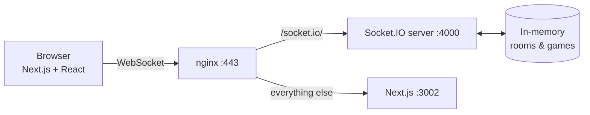

# 🕵️ Mafia

A real-time, browser-based multiplayer implementation of the classic social-deduction game **Mafia** (a.k.a. Werewolf). No accounts, no downloads — create a room, share the code, and play from any phone or laptop on the same link.

<p>
  
  
  
  
  
  
  
</p>

> **Live:** [mafiaweb.duckdns.org](https://mafiaweb.duckdns.org)

---

## ✨ Features

- 🎭 **Four roles** — Mafia, Doctor, and Detective each have a night action; Villagers have only discussion and their vote
- ⚡ **Fully real-time** — every action, vote, and message is pushed over WebSockets; no page reloads
- 🔒 **Per-player secrecy** — the server sends each player a *filtered* view; roles, the Detective's results, and the private Mafia channel never leak to those who shouldn't see them
- 🗳️ **Majority voting** — live tally marks show who's backing each target (and *No vote*); a target only dies on a true majority of the living
- 📜 **Atmospheric narrator** — a fully-local (no external calls) storyteller sets a themed village, gives each player a character title, and narrates every death, quiet night, and lynch
- 💬 **Two chat channels** — open Public Chat plus a private Mafia-only channel for night coordination
- 📱 **Mobile-first** — works across phones and laptops on the same link; reconnects cleanly after a screen lock
- 🚫 **No signup** — anonymous per-room sessions, nothing to install

---

## 🧱 Tech Stack

| Layer | Choices |
|---|---|
| **Language** | TypeScript 5.9 (ESM), npm workspaces monorepo |
| **Frontend** | Next.js 16 (App Router, Turbopack) · React 19 · Tailwind CSS 4 · Framer Motion · socket.io-client |
| **Backend** | Node.js 20 · Express 4 · Socket.IO 4.8 · in-memory game state |
| **Shared** | `@mafia/shared` — types shared by client & server (events, roles, views) |
| **Testing** | Vitest 4 (unit + real Socket.IO integration tests) |
| **Infra** | AWS EC2 (Amazon Linux 2023) · pm2 · nginx reverse proxy · Let's Encrypt (certbot) |

---

## 🗂️ Project Structure

```
mafia-web/
├── apps/
│   ├── server/            # Socket.IO + Express game server
│   │   └── src/
│   │       ├── game/      # state machine, roles, night/day actions, per-player views
│   │       ├── rooms/     # room lifecycle, sessions, idle sweep
│   │       └── socket/    # event handlers + integration tests
│   └── web/               # Next.js client (App Router)
│       ├── app/           # home (create/join) + /room/[roomCode]
│       ├── components/    # Rules, Toast, …
│       └── lib/           # socket + session helpers
└── packages/
    └── shared/            # @mafia/shared — cross-cutting TypeScript types
```

---

## 🚀 Getting Started

**Prerequisites:** Node.js 20+ and npm.

```bash
# 1. Install (postinstall builds the shared types package)
npm install

# 2. Point the web client at your local server
cp apps/web/.env.example apps/web/.env.local   # NEXT_PUBLIC_SERVER_URL=http://localhost:4100

# 3. Run server + client in two terminals
npm run dev:server   # Socket.IO server on :4100
npm run dev:web      # Next.js client on :3200
```

Open **http://localhost:3200**, enter a name, and create a room. Share the room code (or the `:3200` URL) with other players on your network.

### Scripts

| Command | What it does |
|---|---|
| `npm run dev:server` | Server in watch mode (`tsx`) on `:4100` |
| `npm run dev:web` | Next.js dev server on `:3200` |
| `npm run build` | Build shared → server → web |
| `npm run typecheck` | Type-check every workspace |
| `npm test` | Run the server test suite (Vitest) |

---

## 🏛️ Architecture

The browser holds a **single Socket.IO connection**. All state lives in memory on the server, which pushes each player their own filtered view — clients never receive information they aren't entitled to.



In production, **nginx** terminates TLS and serves everything same-origin: `/socket.io/` and `/healthz` are proxied to the Node server, while all other routes go to the Next.js app.

> [!NOTE]
> Game state is held **in process memory** — there is no database. This keeps the app simple and self-contained, but a server restart/redeploy ends any in-progress games. Scaling past one machine (or surviving deploys) would mean adding a state store and the Socket.IO Redis adapter.

---

## 🎲 How to Play

Rooms hold **5–12 players**. Roles are assigned at random when the host starts the game, then play alternates between night and day until one side wins. Mafia scale with the room — **1** for 5–6 players, **2** for 7–9, **3** for 10–12 — plus one Doctor and one Detective; everyone else is a Villager. The host can customize these counts at room creation.

**Win conditions**
- 🧑 **Villagers** (all non-Mafia roles) win by voting out every Mafia member.
- 🔪 **Mafia** win the moment they equal or outnumber the remaining players.

**Phase cycle** (per round)

| Phase | Default | What happens |
|---|---|---|
| 🌙 Night | host-set (30–120s) | Mafia pick a target, Doctor protects, Detective investigates |
| 🔎 Night Results | 15s | Everyone learns who (if anyone) died |
| 💬 Day — Discussion | 180s | Open debate about who to suspect |
| 🗳️ Day — Voting | 60s | Vote someone out (or pick **No vote**); live tally marks show each target's count with the **avatars of who's voting for whom**, and a target that reaches a majority of the living glows red. A player is eliminated **only if they reach that majority** — a tie, a plurality that falls short, or No vote all mean no one dies. Click your pick again to retract it. |
| ⚰️ Elimination | 12s | The eliminated player gets last words |

The host can **+1 min** any running phase (night, discussion, or voting) if players need more time, or **Skip Phase** to end it early.

The game **opens on Day** (Discussion) so no one dies before anyone has spoken — the first death, if any, comes from a day vote.

<details>
<summary><strong>Roles &amp; ground rules</strong></summary>

<br/>

| Role | Ability |
|---|---|
| 🔪 **Mafia** | Each night, agree with fellow Mafia on a player to eliminate. You know your teammates and share a private chat. |
| 🩺 **Doctor** | Each night, protect one player from the Mafia's kill — including yourself — but never the same player two nights in a row (you can't camp one target, or keep self-protecting). |
| 🔍 **Detective** | Each night, investigate one player to privately learn if they're Mafia. |
| 🧑 **Villager** | No special ability — discussion and voting are your only tools. |

- Never announce your role in Public Chat — it removes the deduction from the game.
- Mafia Chat is private; nothing there should be repeated in Public Chat.
- The Detective's results are shown only to the Detective — sharing them (truthfully or as a bluff) is a strategic choice.
- By default, an eliminated player's role is revealed to everyone the moment they die (classic tabletop rules) — the host can turn **Reveal roles on death** off at room creation to keep every role hidden until the game ends. Either way, the dead shouldn't tip off the living.

</details>

---

## 📦 Deployment

Production runs on a single **AWS EC2** box, both processes under **pm2**, behind **nginx** with a Let's Encrypt certificate (auto-renewing).

```bash
# On the server
git pull origin main
npm run build -w packages/shared -w apps/server -w apps/web
pm2 restart mafia-server mafia-web --update-env
```

- `mafia-server` — Node/Socket.IO on `:4000`
- `mafia-web` — `next start -p 3002`
- nginx routes `/socket.io/` + `/healthz` → `:4000`, everything else → `:3002`

---

## 📄 License

No license has been set yet — all rights reserved by default. Add a `LICENSE` file if you intend to make this open source.
